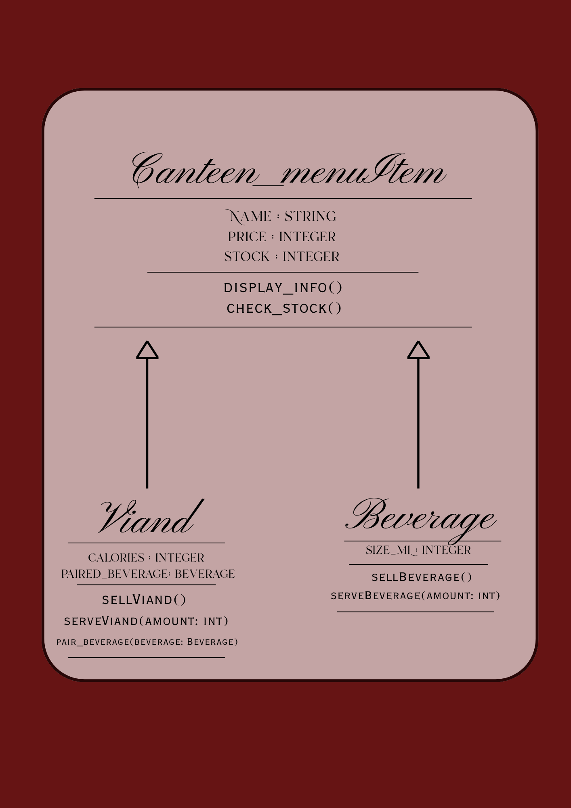
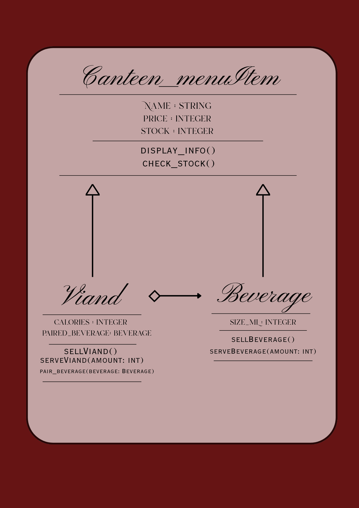
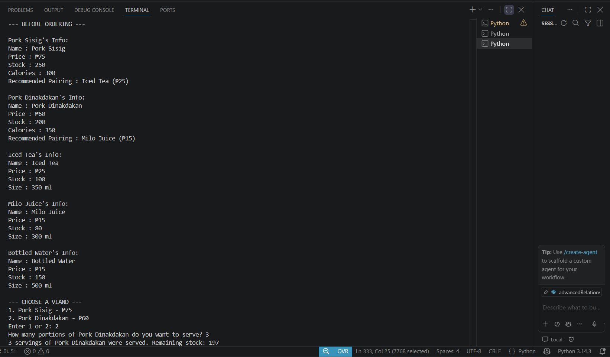
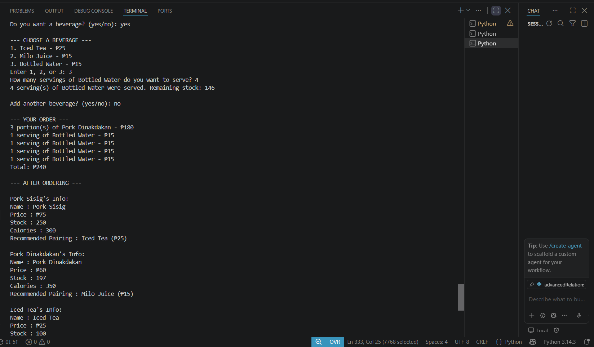
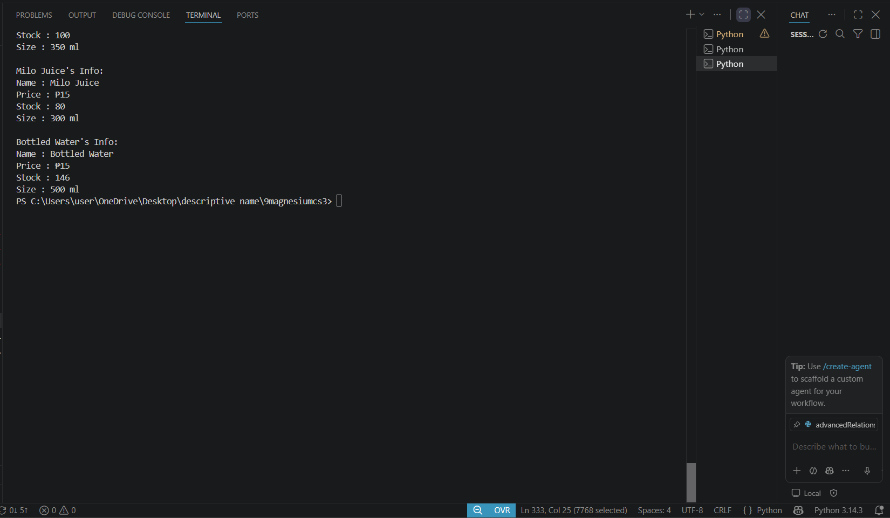
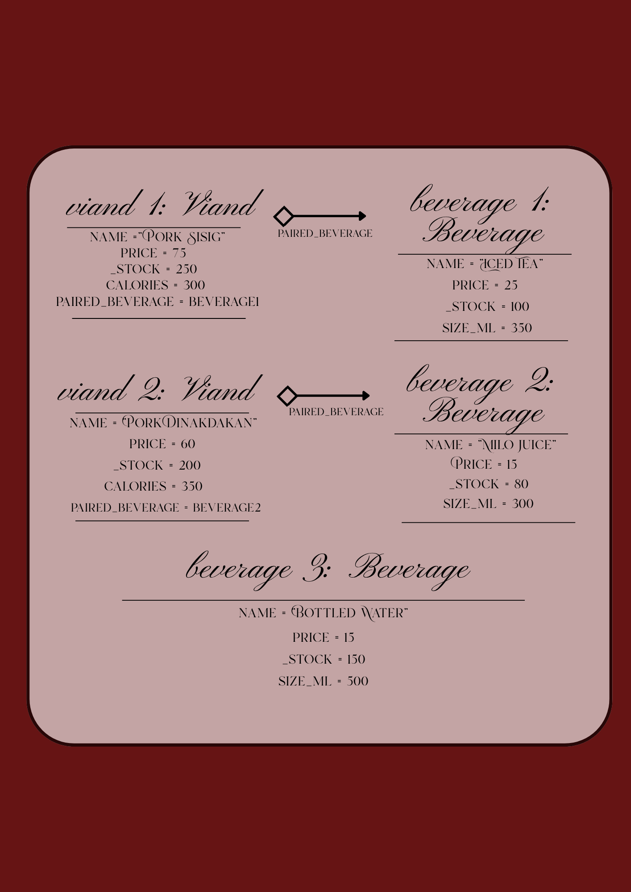

**Name:** Angela 

**Last Name:** Carza

**Section:** 9-Magnesium

**Date:** September 23, 2026

---

# Advanced Class Relationships
## Previous Activities
[classAttrib](classAttributesMethods.md) 
[classRel](classRelationships.md)

--- 

## Existing System Description: 
The different types of viand that the canteen serves during mealtime has a beverage that is paired with it.
## Inheritance Relationship
Parent: Canteen_menuItem
Child: Viand, Beverage
Explanation: Viand and Beverage is a Canteen_menuItem because they are sold at the canteen as part of its menu.

--- 

## Inheritance UML

--- 

## Composition/Aggregation
Relationship: Aggregation
Explanation: The Viand object receives an already existing object and then it stores it as part of its attributes. 

--- 

## Advanced UML Diagram

--- 

## Python Implementation
[Source Code](advancedRelationships.py)

--- 

## Test Run

--- 

## Object Diagram

--- 

## Reflection
Answers:

1. Why did you choose your inheritance relationship? Explain why your child class is a type of your parent class.

Answer: I chose to create the parent class “Canteen_menuItem”because both classes “Viand” and “Beverages” are menu items that are sold at the canteen and has common attributes such as name, price, and stock.

2. How did inheritance reduce duplicate code? Identify attributes or methods that were reused.

Answer: By using inheritance, the same code doesn’t need to be written in both classes because it is already inherited from the parent class.

3. Why is your HAS-A relationship Composition or Aggregation? Explain the lifecycle relationship between the two objects.

Answer: It is aggregation because “Viand” has an existing “Beverage” as its paired beverage, but the beverage can also exist independently. 

4. What is the difference between Association from Part III and the advanced relationship you
Implemented?

Answer: Association refers to the general relationship between classes, but aggregation is more specific because “Viand” stores an existing “Beverage” object through its attribute “paired_beverage”.

5. How does your design follow the DRY principle?

Answer: It follows the DRY principle because there are shared attributes and methods in “Canteen_menuItem”, which allows “Viand” and “Beverage” to inherit them instead of repeating the same code.
