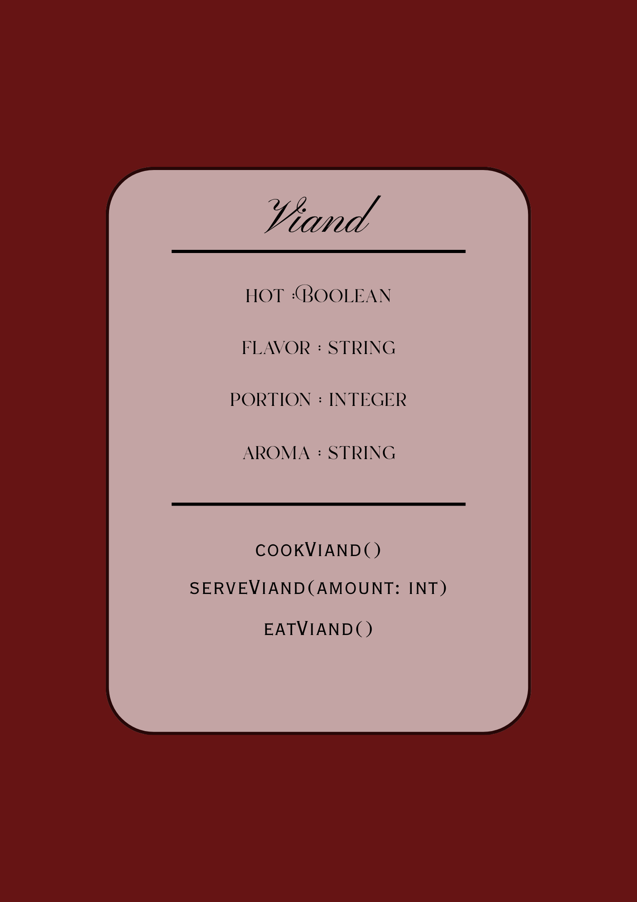
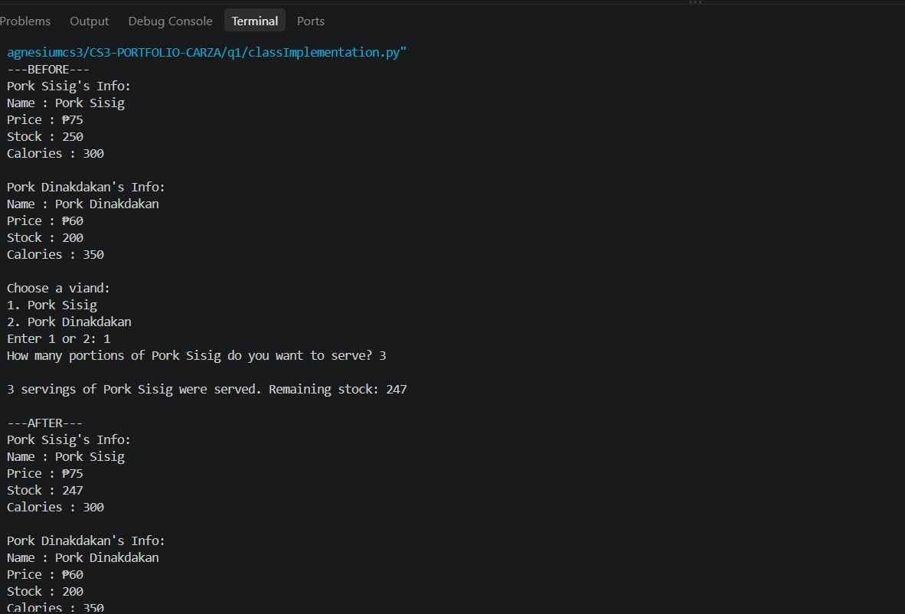
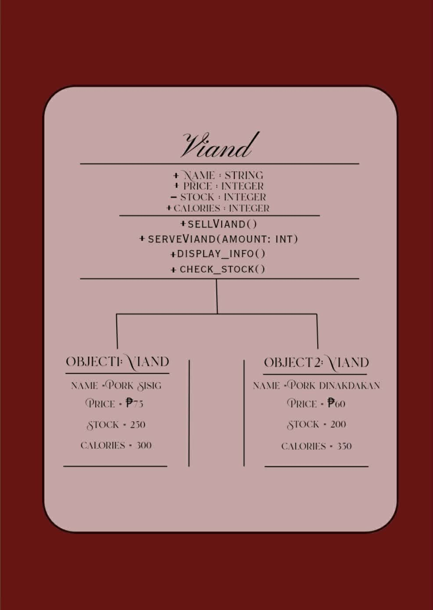

**Name:** Angela 

**Last Name:** Carza

**Section:** 9-Magnesium

**Date:** September 13, 2026

---

# Class Attributes and Methods

## Previous Design
Link to my previous activity:
[classObjectUML.md](classObjectUML.md)

---

## Design Revision
Changes from my previous design:
- Attributes are replaced with “name”, “price”, “stock”, and “calories”
- Data type Hot (boolean) is replaced with string
- Data type of Flavor (string) is replaced with integer
- Data type of Aroma (string) is replaced with integer
- Descriptions are replaced to fit the improved attributes
- Method cookViand() is replaced with sellViand()
- Method eatViand() is replaced with display_info()
- Method check_stock() is added
- Descriptions are replaced to fit the improved methods
- Class Diagram is revised to match the new data
- Design Explanation is revised

---

## Visibility Decisions
| Attribute | Data Type | Visibility | Reason |
|---|---|---|---|
| name | string | Public | The name should be public because it is used to differentiate the viands from each other and to avoid errors when ordering. |
| price | integer | Public | The price should be public because the buyers should know how much they will be spending and whether it will fit their budget. |
| stock | integer | Private | The stock is kept private so as to prevent any unwanted attention and theft. |
| calories | integer | Public | The calories are public because customers are allowed to know how much they are consuming. |

---

## Updated UML Class Diagram

---

## Python Implementation
[View Python Source](classImplementation.py)

---

## Test Run

---

## Object Diagram

---

## Analysis
### Why did you make your chosen attribute private?
I made the attribute "stock" private because it serves as the inventory for the class "Viand".  Privating the attribute also helps hide it from direct external access. By doing so, I can prevent it from being accidentally overwritten or tampered with.

### Which method changes the state of your object?
The sellViand() method changes the state of the object. This is because this method subtracts the amount bought from the current stock. In doing so, it changes the value of the stock attribute.

### How did your two objects demonstrate that instances are independent?
The two objects showed independence because changing one object didn't change the other. For example, when 3 servings of Pork Sisig was sold, only it's stock decreased from 250 to 247, while the Pork Dinakdakan's stock remained unchanged. This implies that each object stores its own data.

### What is the difference between your class diagram and your object diagram?
The class diagram is a visual blueprint of the Viand class, which shows its attributes, methods, and data types. The object diagram shows actual objects created from the class and their current values, and can be changed or updated. For example, the class diagram contains the attribute stock: int, while the object diagram shows stock = 247 for Pork Sisig viand.

---