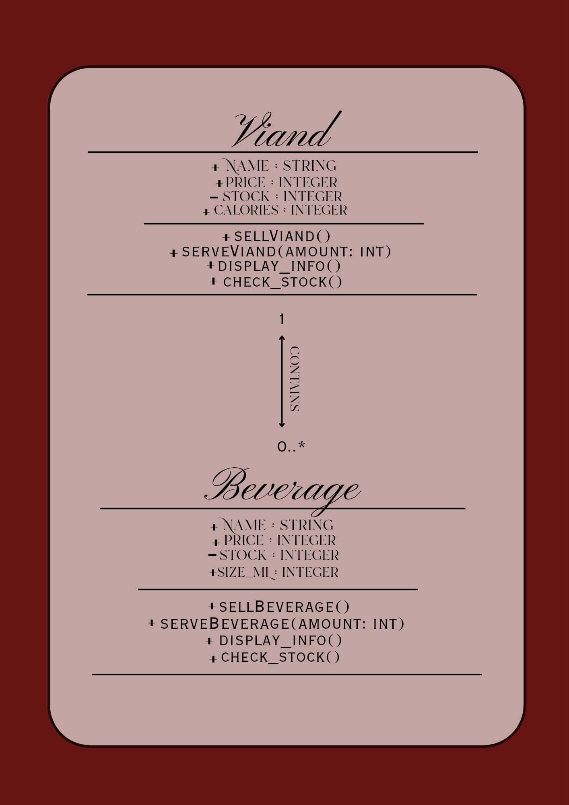
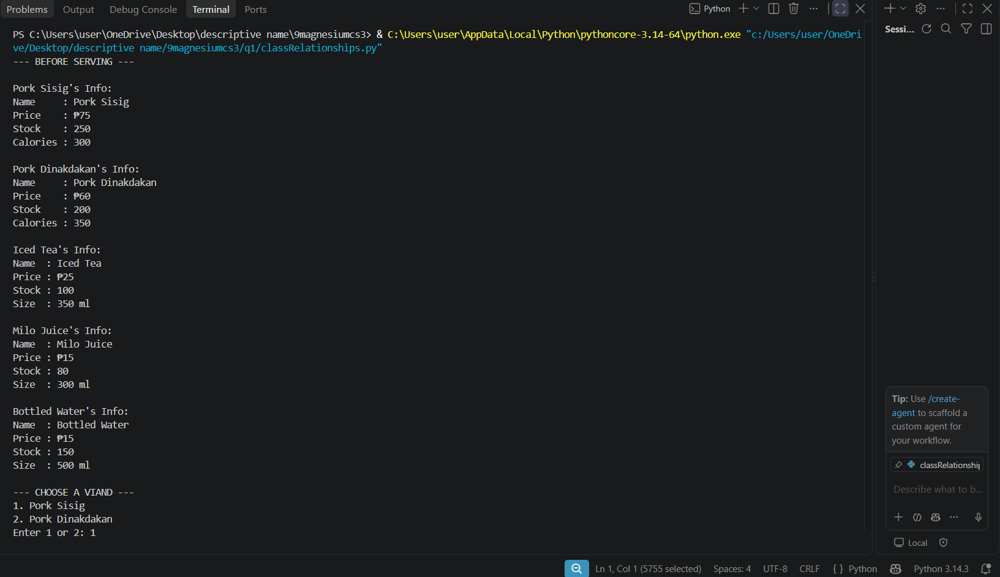
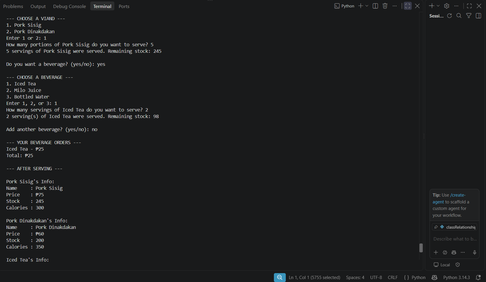
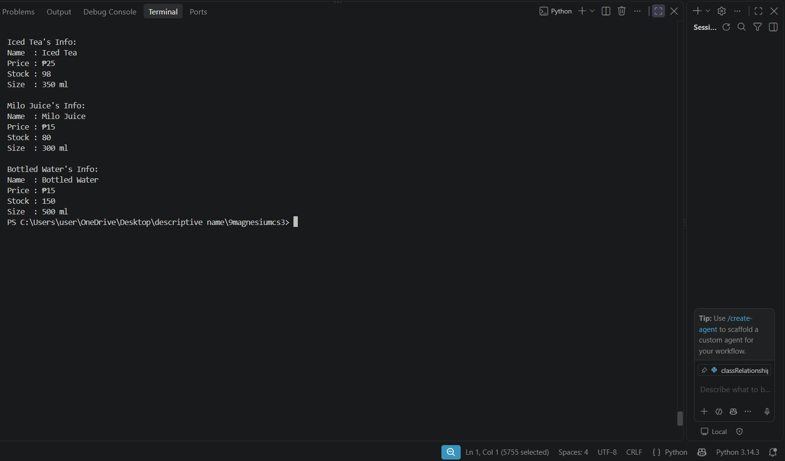
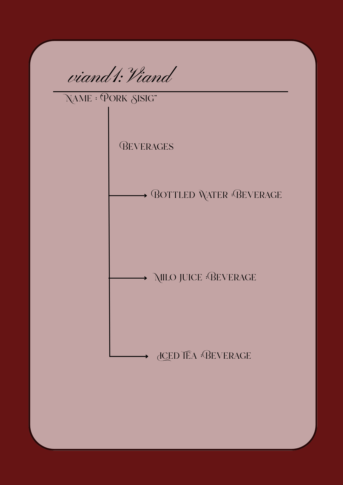

**Name:** Angela 

**Last Name:** Carza

**Section:** 9-Magnesium

**Date:** September 16, 2026

---

# Class Relationships: Association and Multiplicity
## Previous Work
[Part I - Classes and Objects](classObjectUML.md)
[Part II - Class Attributes and Methods](classAttributesMethods.md)

---

## Existing Class
Class: Viand
Description: The different types of viand that the canteen serves during mealtime.

---

## New Related Class
Class: Beverage
Description: The drinks often paired with viands that are bought at the canteen.

---

## Association
Relationship: A Viand has a Beverage.
Explanation: Oftentimes, meals with a viand are paired with beverages.

---

## Multiplicity
Multiplicity: 0..* or Zero or more
Explanation: A customer may choose zero to multiple beverages to pair with their viand. For example, both water and Milo can be paired with Pork Sisig, or none at all, based on the preferences of the customer. 

---

## UML Class Relationship Diagram

---

## Python Implementation
[View Python Source](classRelationships.py)
*IntelliSense was utilized in the making of this code* (sorry sir, nahirapan po talaga kasi ako:(, pero inaral ko po medj yung mga tig tab ko lang haha)

---

## Test Run

---

## Object Relationship Diagram

---

## Analysis
### What is the association between your two classes?
	The first class “Viand” is a food that the canteen serves during mealtime that is paired with rice and drinks. Thus the second class “Beverages” indicate the drinks that are often paired with viands. The two classes are therefore defined as “Viand has a beverage”.

### What multiplicity did you choose and why?
	I chose the zero to many multiplicity. This is because many often like to pair multiple beverages with viands. Some may like both water and milo juice, while some may only like water. However, some may also prefer not to have any beverages to pair with it at all.

### How did you implement the relationship in Python?
	I implemented this relationship in Python by using the beverage_menu which contains beverage objects. Then in the while loop, the program matches the user’s input with beverage_menu[beverage_choice] and then calls the method serveBeverage() on that object. The main script uses both, but there is no direct link between the two classes.

### Why did you store an object reference instead of copying its data?
	I stored an object reference instead of copying its data because the object itself is what needs to be updated. For example, the serveBeverage() method lowers self.__stock on the real Beverage object. If I had copied the data instead, I would’ve had a text string only, and I wouldn’t be able to call serveBeverage() on it.

### If your relationship uses many, why is a list appropriate?
	A list is appropriate because it keeps drinks in the order they were chosen. It also lets the same drink appear twice and be ordered again. Furthermore, it can grow anytime, since the customer’s order is still unknown until the order is placed. 
