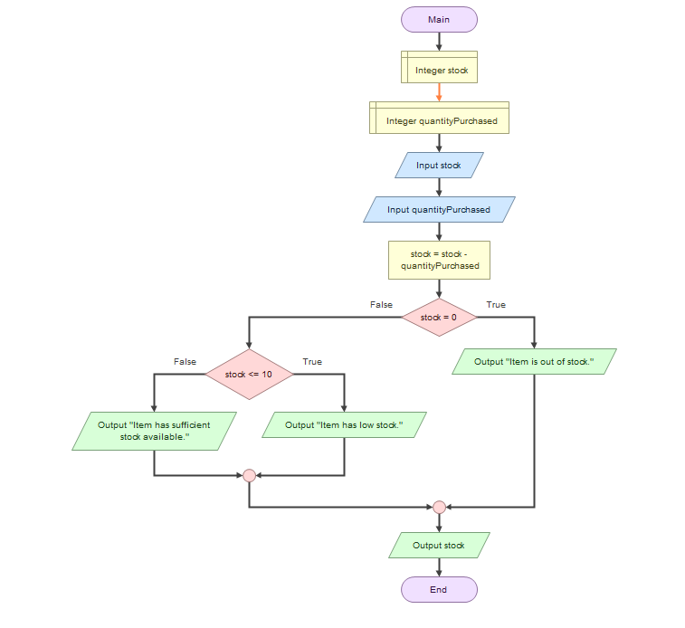

# Computational Thinking Exercise
## Smart School Canteen Queue 
**Name:** Angela 
**Section:** 9Magnesium
**Last Name:** Carza
**Date:** August 19, 2026
---
## Step 1: Identify the Big Problem
### Main Problem
During Lunch Hours in PSHS-BRC, the canteen is often swarmed with both students and teachers alike, causing its performance level to decrease and their serving time to be slower.
---
## Step 2: Identify the Sub-Problems
1. Pre Order Dilemma; Ordering takes longer because the student takes time to decide what they will buy and often still has to look around for available food items.
2. Manual Calculation of Cost; Cashiers would sometimes have to manually calculate the total payment of each order. 
3. Manual Calculation of Change; Cashiers would also often have to manually calculate the appropriate change.
4. Stock Tracker; There is currently no system to help the staff track which food items are running out.
---
## Step 3: Apply Computational Thinking Skills
| Sub-Problem | CT Skill | Proposed Solution |
|---|---|---|
| Pre Order Dilemma | Abstraction | Show only the important information, such as the food name, price, and availability, so students can quickly choose what to order. |
| Manual Calculation of Cost | Decomposition | Break down the computation process into steps. First calculate the price of each item, then add the costs to get the total. |
| Manual Calculation of Change | Decomposition | Break down the computation process into steps. First enter the amount paid, and then subtract the total from the payment to get the change. |
| Stock Tracker | Algorithm Design | Create a step-by-step process that records the stock, subtracts the quantity whenever an item is purchased, and alerts the staff when an item is running low. |
---
## Step 4: Algorithmic Solution
### Selected Sub-Problem
Stock Tracker; There is currently no system to help the staff track which food items are running out.
### Flowchart

---
## Reflection
Decomposition helps solve the canteen scenario by breaking the main problem down to 4 manageable subproblems such as ordering, payment process, and inventory monitoring. By doing so, solving the main problem becomes much easier as it allows us to visualize clear steps on how to solve it. And as each subproblems are separately solved, we then combine it into one system in which each part is properly addressed. 
The CT skills used are abstraction, decomposition, and algorithm design. Abstraction helps the student focus on the important information needed for ordering, decomposition breaks the payment process into simpler steps, and algorithm design provides a clear procedure for tracking item stocks. By using these strategies, the canteen process will become faster, and much more organized.
