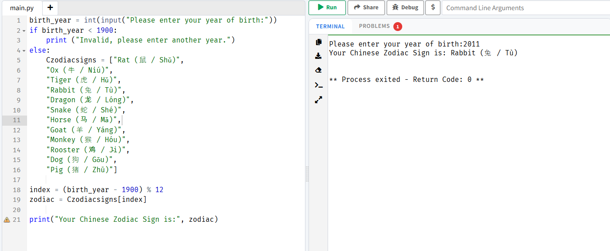

# Chinese Zodiac Exercise

**Name:** Angela 

**Last Name:** Carza  

**Section:** 9-Magnesium 

**Date:** August 19, 2026

---

## Requirements

a. Year of birth with baseline year of 1900.
b. Validated user input that should not be earlier than 1900.
c. If the user enters an invalid year then display an appropriate message then stop or abort the program.

---

## Python Code

```python
birth_year = int(input("Please enter your year of birth:"))
if birth_year < 1900:
    print ("Invalid, please enter another year.")
else:
    Czodiacsigns = ["Rat (鼠 / Shǔ)",
    "Ox (牛 / Niú)",
    "Tiger (虎 / Hǔ)",
    "Rabbit (兔 / Tù)",
    "Dragon (龙 / Lóng)",
    "Snake (蛇 / Shé)",
    "Horse (马 / Mǎ)",
    "Goat (羊 / Yáng)",
    "Monkey (猴 / Hóu)",
    "Rooster (鸡 / Jī)",
    "Dog (狗 / Gǒu)",
    "Pig (猪 / Zhū)"]
        
index = (birth_year - 1900) % 12
zodiac = Czodiacsigns[index]
        
print("Your Chinese Zodiac Sign is:", zodiac)
```
[View Chinese Zodiac Code](q1/zodiacMagnesiumCarza.py)

---
## Output



